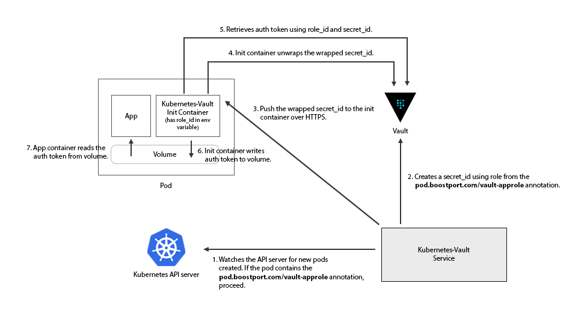

# Kubernetes Vault Integration
The Kubernetes-Vault project allows pods to automatically receive a Vault token using Vault's [AppRole auth backend](https://www.vaultproject.io/docs/auth/approle.html).



## Highlights
* Secure by default. The Kubernetes-Vault controller does not allow using root tokens to authenticate against Vault.
* Prometheus metrics endpoint over http or https, with optional TLS client authentication.
* Supports using Vault as a CA or an external CA for all components with TLS support.
* High availability mode using Raft, so that if the leader goes down, a follower can take over immediately.
* Peer discovery using Kubernetes services and endpoints and gossip to propagate peer changes across the cluster.

## Prerequisites:
* Vault should be 0.6.3 and above.
* You must use Kubernetes 1.4.0 and above as we rely on init containers (in beta) to accept the token.
* You must generate a periodic token with the correct policy to generate `secret_id`s using the AppRole backend.
* The Kubernetes-Vault controller uses the Kubernetes service account to watch for new pods. This service account must have the appropriate permissions.
* Your app should use a [Vault client](https://www.vaultproject.io/docs/http/libraries.html) to renew the token and any secrets you request from Vault.
* You should configure Vault to use HTTPS, so that the authentication token and any other secrets cannot be sniffed.

## Get started
To run Kubernetes-Vault on your cluster, follow the [quick start guide](quick-start.md).

## Best practices
See our list of [best practices](best-practices.md).

## Token format
The token information is encoded as JSON and written to the file. Here's an example of what it looks like:

```json
{
   "clientToken":"91526d9b-4850-3405-02a8-aa29e74e17a5",
   "accessor":"476ea048-ded5-4d07-eeea-938c6b4e43ec",
   "leaseDuration":3600,
   "renewable":true,
   "vaultAddr":"https://vault:8200"
}
```

You application should parse the JSON representation and renew the `clientToken` using the `leaseDuration` as a guide.

## CA bundle
If you are connecting to Vault over https (highly recommended for production), you will find the CA bundle for Vault in
the file `ca.crt`. Use the CA bundle when connecting to Vault using your application, so that the identity of Vault is
verified.

## Configuration
The project consists of 2 containers, a controller container that watches the Kubernetes cluster and pushes `secret_id`s to pods and an init container that
receives the `secret_id` and exchanges it for an auth token. These 2 containers are configured using environment variables. The init container also requires
configuration using Kubernetes annotations.

For full examples of configuration files, check out the ConfigMaps in the [quick start](deployments/quick-start/kubernetes-vault.yaml) and [secured](deployments/secured-external-ca/kubernetes-vault.yaml) examples.

### Kubernetes-Vault controller configuration
The Kubernetes-Vault is configured using a YAML file. We recommend using a ConfigMap to mount the file and any other files
( such as certificates and private keys, if using an external CA) into the controller's pod.

The controller automatically expands any environment variables used in the configuration specified using the `$VARIABLE` or 
`${VARIABLE}` notation. For example, if you set `raftDir: ${MY_DIR}` and set the `$MY_DIR` environment variable to `/tmp`, it 
 expands to: `raftDir: /tmp`.
 
 By default, the controller looks for configuration in `kubernetes-vault.yml` in the current working directory, but you
 can override this by setting the `-config` flag with the absolute path to your config file.

The available configuration options in the config file are:

#### raftDir *(optional)*
The location where raft data should be stored. By default this is: `/var/lib/kubernetes-vault/`.

If you want to set a custom location:
```yaml
raftDir: /my/custom/raft/dir
```

#### vault *(required)*
Settings for communicating with the Vault server. It contains nested properties:

##### addr *(required)*
The address of the Vault server. For example, `http://vault:8200`.

##### token *(required)*
A renewable and periodic Vault token to be used by the Kubernetes-Vault controller.

##### tls *(optional)*
If Vault is secured using TLS (https), then you need to set one of the following:

###### vaultCABackends *(optional)*
If Vault uses itself as a certificate authority, provide the list of root PKI backends here.

###### caCert *(optional)*
If Vault uses an external CA, provide the absolute path to a file containing the CA certificates in PEM format.

##### Example (using Vault as a CA):
```yaml
vault:
  addr: http://vault:8200
  token: 91526d9b-4850-3405-02a8-aa29e74e17a5
  tls:
    - root-ca
```

#### kubernetes *(required)*
Settings for talking to the Kubernetes API server.

##### namespace *(required)*
The Kubernetes namespace to watch for newly created pods.

##### service *(required)*
The Kubernetes service being used by the Kubernetes-Vault controller, so that it can discover other Kubernetes-Vault
controllers to form a cluster.

##### Example:
```yaml
kubernetes:
  # Note the use of an environment variable here, which will be expanded by the controller
  namespace: ${KUBERNETES_NAMESPACE}
  service: kubernetes-vault
```

#### prometheus *(optional)*
Configuration for the Prometheus endpoint.

##### tls *(optional)*
TLS configuration for the Prometheus endpoint. You can use Vault as the CA or an external CA. If using Vault as the CA,
you must set `vaultCertBackend`, `vaultCertRole`, `vaultCABackends`. Otherwise, set `certFile`, `certKey`, and `caCert`
if using an external CA.

###### vaultCertBackend *(optional)*
The Vault PKI backend to be used to issue certificates for securing the Prometheus metrics endpoint.

###### vaultCertRole *(optional)*
The Vault PKI role to be used to issue certificates for securing the Prometheus metrics endpoint.

###### vaultCABackends *(optional)*
If you want to enable client TLS authentication against the Prometheus scrappers, set the list of Vault PKI backend
being used as a certificate authority for those scrappers here.

###### certFile *(optional)*
If using an external CA, provide the absolute path to the certificate in PEM format here.

###### certKey *(optional)*
If using an external CA, provide the absolute path to the key for the certificate in PEM format here.

###### caCert *(optional)*
If you want to enable client TLS authentication against the Prometheus scrappers, provide the absolute path to the file
containing the root certificates in PEM format here.

##### Example:
```yaml
prometheus:
  tls:
    # Note that vaultCABackends is not set, so TLS client authentication for the scrappers will not be 
    # enabled.
    vaultCertBackend: intermediate-ca
    vaultCertRole: kubernetes-vault
```

### Init container configuration
The init containers are configured using environment variables and Kubernetes annotations.

#### Environment variables

| Environment Variable  | Description                                                                              | Required  | Default Value                                | Example                                 |
|-----------------------|------------------------------------------------------------------------------------------|-----------|----------------------------------------------|-----------------------------------------|
| VAULT_ROLE_ID         | The Vault role id.                                                                       | `yes`     | `none`                                       | `313b0821-4ff6-1df8-54dd-c3eea5d3b8b1`  |
| CREDENTIALS_PATH      | The location where the Vault token and CA Bundle (if it exists) will be written          | `no`      | `/var/run/secrets/boostport.com`             | `/var/run/my/path`                      |

#### Pod annotations

| Annotation                              | Description                         | Required  | Default Value | Example       |
|-----------------------------------------|-------------------------------------|-----------|---------------|---------------|
| pod.boostport.com/vault-approle         | The Vault role.                     | `yes`     | `none`        | `sample-app`  |
| pod.boostport.com/vault-init-container  | The name of the init container.     | `yes`     | `none`        | `install`     |

## Metrics
Kubernetes-Vault uses [Prometheus](https://prometheus.io) for metrics reporting. It exposes these metrics over the `/metrics` endpoint over http or https.

For more information about metrics, read the guide on [metrics](metrics.md).

## Development
PRs are highly welcomed!

We use glide as our dependency manager. To work on the project, install glide, then run `glide install --strip-vendor`.

Docker is used to build the binaries, so you need to have docker installed.

The project also comes with a few scripts to simplify building binaries and docker containers and pushing docker containers.
Simply run `build.sh` to build the binaries. To build and push images, simplify run `build-images.sh`.
Running `build-images.sh` also automatically runs `build.sh`.

## License
This project is licensed under the Apache 2 License.